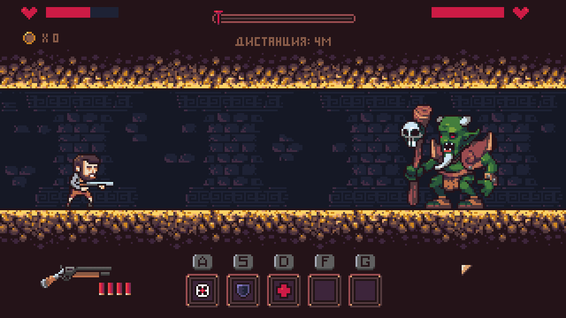
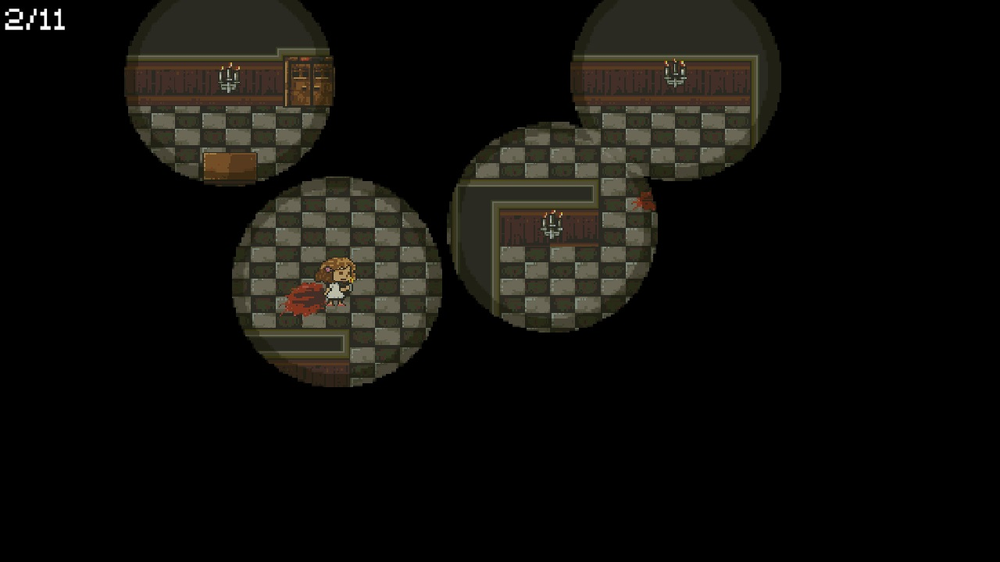
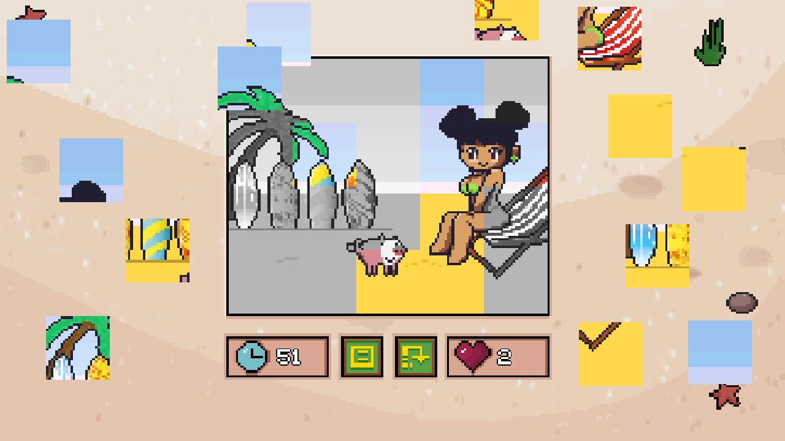
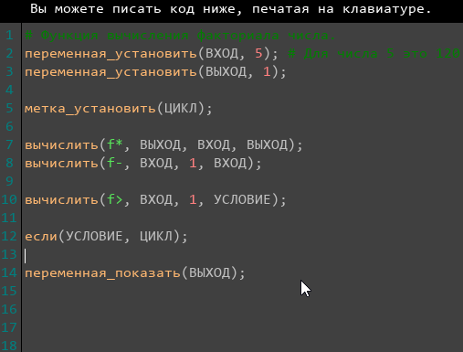
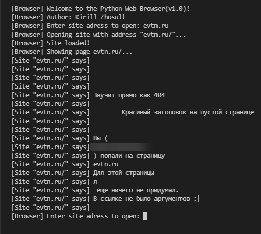
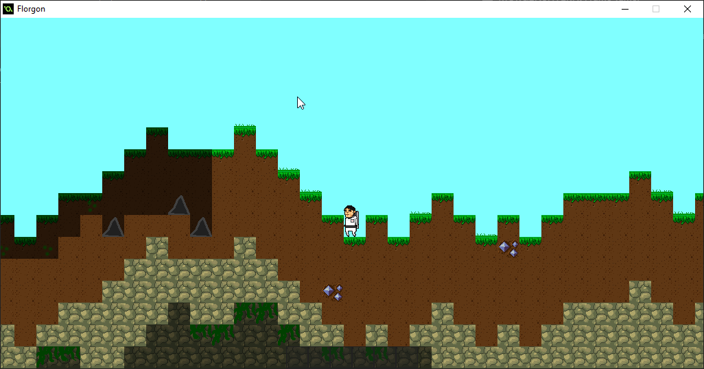
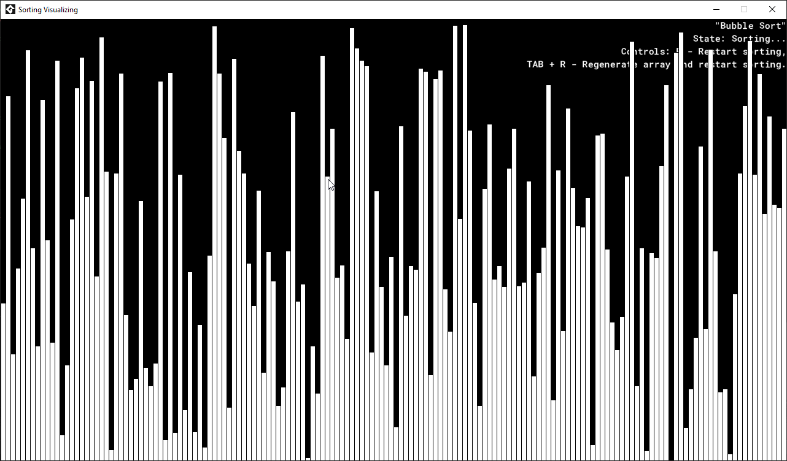

<h1>
  Hello, stranger!
   
</h1>

  <h3>
    Hello! Welcome to my GitHub profile! My name is Kirill and i'm currently working as Game Developer
    
    for about 5 years! Currently living in 
    
    Russia.
     
  </h3>

  <h3>
    Some useful information:
  </h3>
  

    
    
    
    
    
  

  

    
    
  

  

    
    
    
  

  

     
     
     
     
  

  
  
  

  <h1> Projects:</h1>
  
  <h2> Games: </h2>
  
  
  
  
   
  
  <h2> Other: </h2>
 
  
  
  
  
  
  
  
  
  

